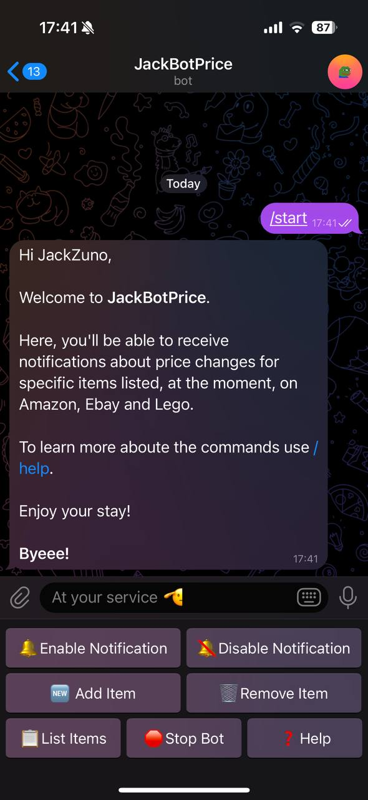
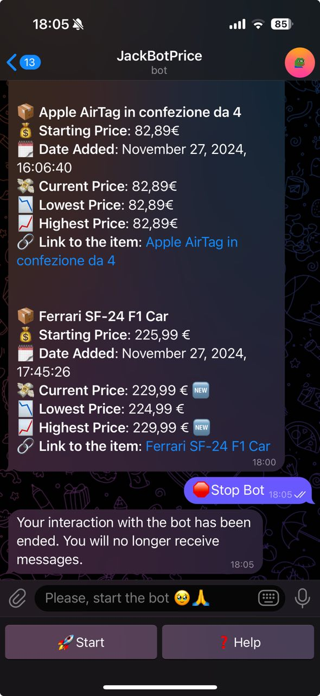
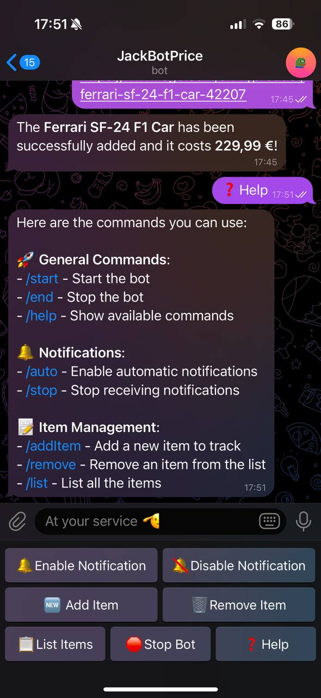
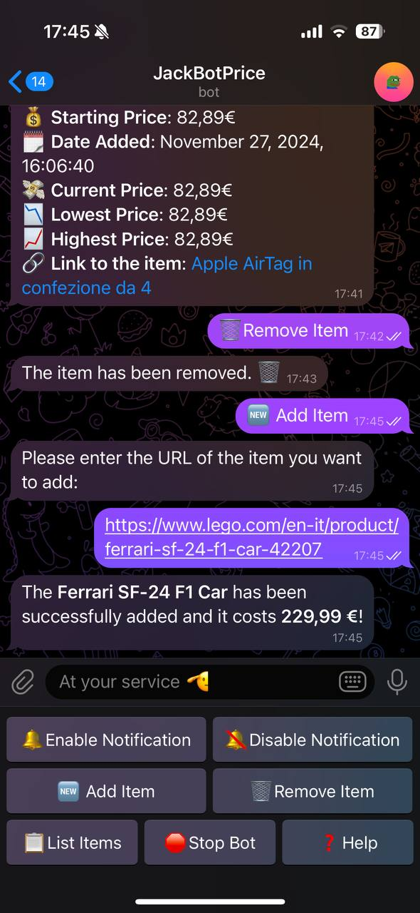
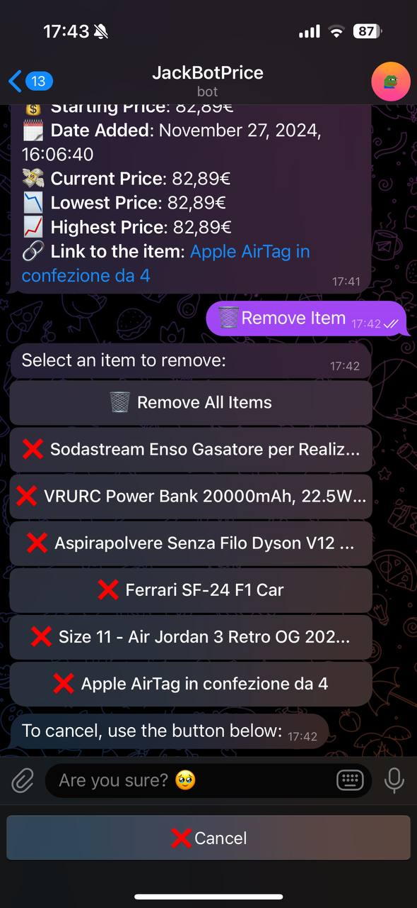
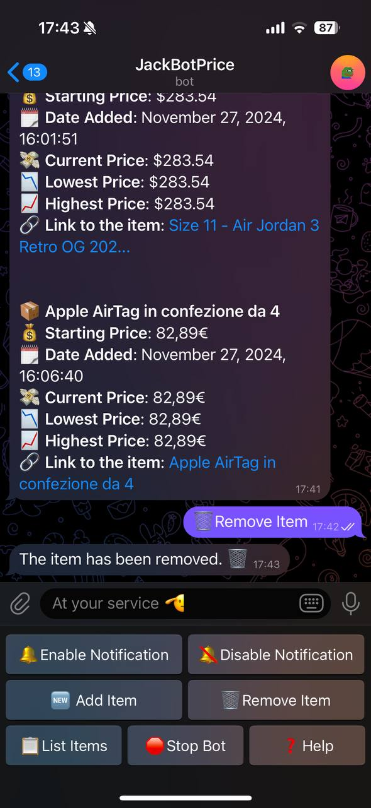
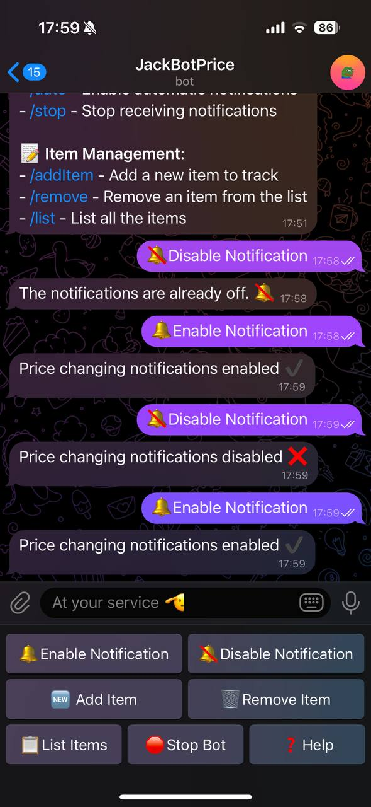
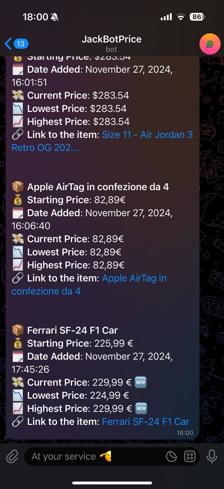
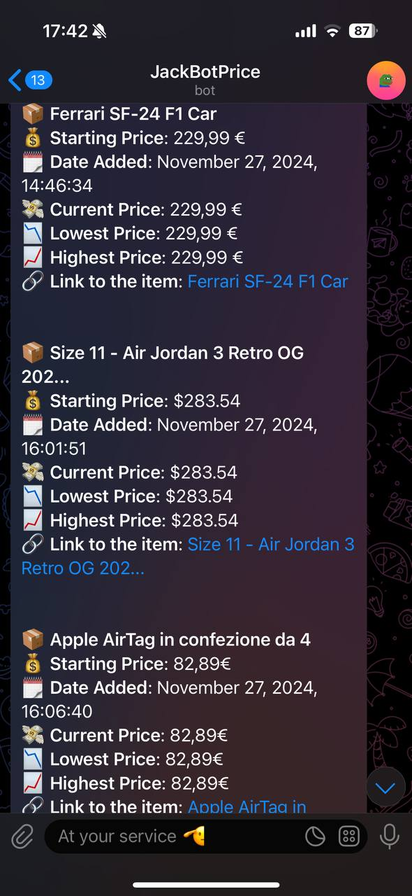

# AmazonPriceBot

## Content
The AmazonPriceBot is a Telegram bot designed to track price fluctuations of specific items. Users can add items to the bot's watchlist using the **/add** command (["add example"](#add-image)), where the only required parameter is the item's URL. Currently, the bot supports online stores such as Amazon (tested with Amazon IT and UK), eBay (tested with eBay IT, UK, and USA), and the Lego Store.

Once items are added, they can be listed using the **/list** command (["list example"](#list-image)). This command will display key details for each item, including its *name*, *initial price* at the time of addition, *date* of addition, and the *current price*. It will also show the *lowest* and *highest price* recorded, along with a clickable URL that directs to the product page.

Users can remove individual items or clear all items from their list through a specific button (or the **remove all** or the **remove item_name**). If the user want to cancel the operation, the bot provide a **cancel** button for easy exit (["remove example"](#add-image)). After an item is removed, the bot will delete any prior messages related to that item and notify the user whether the deletion was successful.

The bot also offers the option to **enable or disable notifications** (["enable/disable example"](#list-image)). When notifications are enabled, the bot sends updates twice daily—once in the morning and once in the evening. These notifications include the same information as the **/list** command, but the bot will first check for any price changes and update the current price accordingly (["message example"](#list-image)). If there are any changes in price, a new emoji is added to indicate the specific update.

If a user decides to disable notifications, the bot will stop sending updates about price changes. Additionally, if there are no items in the list, the bot will suggest disabling notifications.

If a user blocks the bot without first issuing the **/end** command (["stop bot example"](#start-image)), the bot will automatically stop sending messages after the first notification is sent following the block. The bot detects this situation through an exception triggered after a scheduled message fails to send due to the block from the user.

Finally, the **/help** command provides a list of all available commands in the bot (["help example"](#start-image)).

## Usage Example

{width="30%"} {width="30%"} {width="30%"}

{width="30%"} {width="30%"} {width="30%"}

 
{width="30%"} {width="30%"} {width="30%"}

<!-- 

  
  
  

  
  
  

  
  
  

 -->
